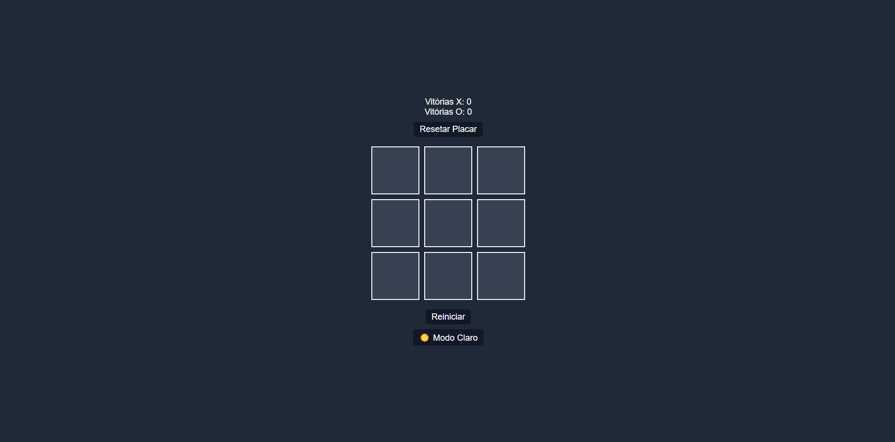

# 🎮 Jogo da Velha

Um jogo da velha clássico (tic-tac-toe) feito com HTML, CSS e JavaScript puro. Dois jogadores se revezam para marcar X e O em um tabuleiro 3x3 até que um deles vença ou ocorra um empate.

🔗 **Acesse o projeto online:** [GitHub Pages](https://github.com/endriusssantos/jogo-da-velha)

---

## ✨ Funcionalidades

- ❌ **Jogador X vs O**: Dois jogadores humanos se revezam jogando no mesmo dispositivo.
- 🧠 **Verificação de Vitória**: O jogo reconhece automaticamente vitórias em linha, coluna ou diagonal.
- 🚫 **Empate**: Caso o tabuleiro seja preenchido sem vencedores, o jogo detecta o empate.
- 🔄 **Reiniciar Jogo**: Botão para começar uma nova partida a qualquer momento.
- 📱 **Responsivo**: Funciona bem em dispositivos móveis e desktops.
- 🎨 **Visual Clean**: Estilo simples e limpo, com bom contraste e usabilidade.

---

## 🛠️ Tecnologias Utilizadas

- **HTML5**
- **CSS3**
  - Layout com Grid
  - Estilização do tabuleiro e botões
- **JavaScript (Vanilla)**
  - Manipulação de DOM
  - Lógica de jogo
  - Verificação de combinações vencedoras

---

## 📂 Estrutura de Pastas

```
jogo-da-velha/
├── index.html
└── src/
    ├── css/
    │   ├── reset.css
    │   └── style.css
    └── js/
        └── script.js
```

---

## 🚀 Como Rodar o Projeto

1. Clone o repositório:

```bash
git clone https://github.com/endriusssantos/jogo-da-velha
cd jogo-da-velha
```

2. Abra o arquivo index.html em seu navegador, ou use uma extensão como "Live Server" no VSCode.

---

## 💡 Possíveis Melhorias Futuras

- 🤖 Adicionar modo de jogo contra a máquina (IA simples).
- 🧑‍🎨 Melhorar a interface com animações e sons.

---

## 📸 Preview



---

## 🧑‍💻 Autor

Feito com 💙 por Endrius da Silva dos Santos
